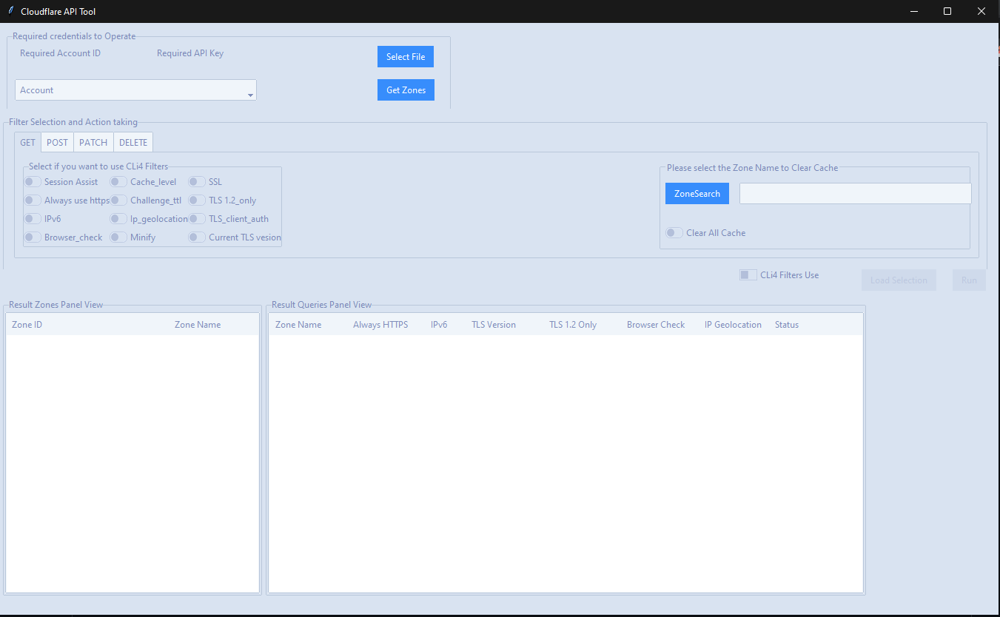
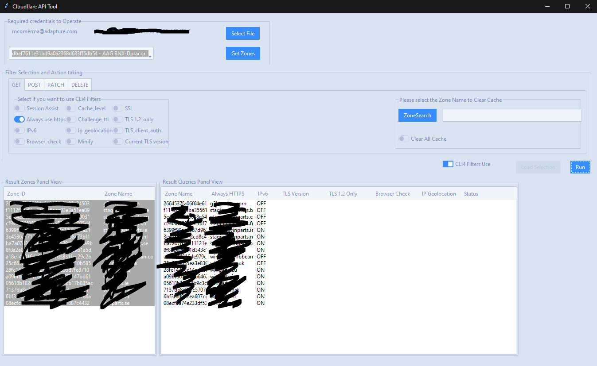

# Cloudflare_UI 

## Graphical User Interface Script

 

 

### What it does (need to detail specific functions)

* Opens the authentication file stored in the system.
   It saves the credentials and it re-writes Cloudflare Api authentication credentials.
   Modifying Cloudflare API Creds allows us to link connection between Cloudflare operations and CloudFlare API calls.

* ComboBox that displays all the accounts the user credentials has visibility on.
   GetZones button, list the zones as per Account Selected
   The list result appear in a list box ID and Name
   Functionality to copy/paste selected rows added

* Filter Settings section here we use checkboxes to select which settings we are interested
  to see.
* Cli Square checkbox is the only abailable option afterwards.
  It checks for the filters selected and for the rows, shows a messagebox to ensure you double check the selection for the query.
  The Checkbox then activates Load Settings Button to load selection
  Finally the **Run** button activates.
  
  _If Toggle Off the Cli Checkbox it restets the application (to be detailed)_

    
* Displays the query to a secondary list box (copy/paste not added yet)

 

Here is how it looks like after applying a filter.

