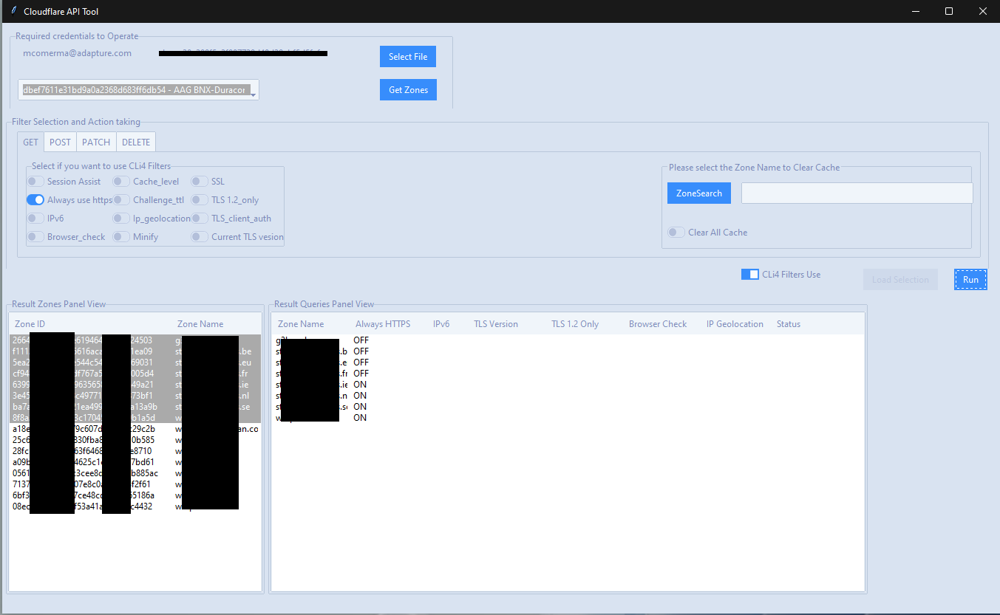

# Cloudflare_UI 

## Graphical User Interface Script

<br>


<br>

### What it does (need to detail specific functions)

* Opens the authentication file stored in the system.
   It saves the credentials and it re-writes Cloudflare Api authentication credentials.
   Modifying Cloudflare API Creds allows us to link connection between Cloudflare operations and CloudFlare API calls.

* ComboBox that displays all the accounts the user credentials has visibility on.
   GetZones button, list the zones as per Account Selected
   The list result appear in a list box ID and Name
   Functionality to copy/paste selected rows added

* Filter Settings section here we use checkboxes to select which settings we are interested
  to see.
* Cli Square checkbox is the only abailable option afterwards.
  It checks for the filters selected and for the rows, shows a messagebox to ensure you double check the selection for the query.
  The Checkbox then activates Load Settings Button to load selection
  Finally the **Run** button activates.
  
  _If Toggle Off the Cli Checkbox it restets the application (to be detailed)_

    
* Displays the query to a secondary list box (copy/paste not added yet)

<br>

Here is how it looks like after applying a filter.



```

*****************************  NEXT STEPS  *************************

+ Create a function to execute all the Selected Checkboxes
+ Create a Dictionary to store all the returned values from above.
+ Display all the zones and settings values in the Result listbox

********************************************************************

````

RESOURCE:

https://github.com/cloudflare/python-cloudflare/blob/master/README.md


## Some info about running commands with the Cli4 interaction

### Simple CLI examples

 * ```cli4 /user/billing/profile```
 * ```cli4 /user/invites```

 * ```cli4 /zones/:example.com```
 * ```cli4 /zones/:example.com/dnssec```
 * ```cli4 /zones/:example.com/settings/ipv6```


``` bash

>cli4 /zones/:calskel.com/settings/ssl
{
    "certificate_status": "active",
    "editable": true,
    "id": "ssl",
    "modified_on": "2023-04-18T18:16:14.744449Z",
    "validation_errors": [],
    "value": "flexible"
}

>cli4 /zones/:calskel.com/settings/tls_1_2_only
cli4: /zones/:calskel.com/settings/tls_1_2_only - not found

C:\Users\PC>cli4 /zones/:calskel.com/settings/tls_client_auth
{
    "editable": true,
    "id": "tls_client_auth",
    "modified_on": null,
    "value": "off"
}

>

```


Here is the table of commands from cloudflare-python:

<br>

## cloudflare-python Table of commands

|`GET`   |`PUT`   |`POST`  |`PATCH` |`DELETE`|API call|
|--------|--------|--------|--------|--------|:--------|
|`GET`   |        |`POST`  |        |`DELETE`|/certificates|
|`GET`   |        |        |        |        |/ips|
|`GET`   |        |        |`PATCH` |        |/organizations|
|`GET`   |        |`POST`  |`PATCH` |`DELETE`|/organizations/:identifier/firewall/access_rules/rules|
|        |        |        |`PATCH` |        |/organizations/:identifier/invite|
|`GET`   |        |`POST`  |        |`DELETE`|/organizations/:identifier/invites|
|`GET`   |        |        |`PATCH` |`DELETE`|/organizations/:identifier/members|
|`GET`   |        |`POST`  |`PATCH` |`DELETE`|/organizations/:identifier/railguns|
|`GET`   |        |        |        |        |/organizations/:identifier/railguns/:identifier/zones|
|`GET`   |        |        |        |        |/organizations/:identifier/roles|
|`GET`   |        |`POST`  |`PATCH` |`DELETE`|/organizations/:identifier/virtual_dns|
|`GET`   |        |`POST`  |`PATCH` |`DELETE`|/railguns|
|`GET`   |        |        |        |        |/railguns/:identifier/zones|
|`GET`   |        |        |`PATCH` |        |/user|
|`GET`   |        |        |        |        |/user/billing/history|
|`GET`   |        |        |        |        |/user/billing/profile|
|`GET`   |        |        |        |        |/user/billing/subscriptions/apps|
|`GET`   |        |        |        |        |/user/billing/subscriptions/zones|
|`GET`   |        |`POST`  |`PATCH` |`DELETE`|/user/firewall/access_rules/rules|
|`GET`   |        |        |`PATCH` |        |/user/invites|
|`GET`   |        |        |        |`DELETE`|/user/organizations|
|`GET`   |        |`POST`  |`PATCH` |`DELETE`|/user/virtual_dns|
|`GET`   |        |`POST`  |`PATCH` |`DELETE`|/zones|
|        |`PUT`   |        |        |        |/zones/:identifier/activation_check|
|`GET`   |        |        |        |        |/zones/:identifier/analytics/colos|
|`GET`   |        |        |        |        |/zones/:identifier/analytics/dashboard|
|`GET`   |        |        |        |        |/zones/:identifier/available_plans|
|        |`PUT`   |        |        |        |/zones/:identifier/custom_certificates/prioritize|
|`GET`   |        |`POST`  |`PATCH` |`DELETE`|/zones/:identifier/custom_certificates|
|`GET`   |`PUT`   |        |        |        |/zones/:identifier/custom_pages|
|`GET`   |`PUT`   |`POST`  |        |`DELETE`|/zones/:identifier/dns_records|
|`GET`   |        |        |`PATCH` |        |/zones/:identifier/firewall/waf/packages/:identifier/groups|
|`GET`   |        |        |`PATCH` |        |/zones/:identifier/firewall/waf/packages/:identifier/rules|
|`GET`   |        |        |`PATCH` |        |/zones/:identifier/firewall/waf/packages|
|`GET`   |        |`POST`  |`PATCH` |`DELETE`|/zones/:identifier/firewall/access_rules/rules|
|`GET`   |        |`POST`  |`PATCH` |`DELETE`|/zones/:identifier/keyless_certificates|
|`GET`   |`PUT`   |`POST`  |`PATCH` |`DELETE`|/zones/:identifier/pagerules|
|        |        |        |        |`DELETE`|/zones/:identifier/purge_cache|
|`GET`   |        |        |        |        |/zones/:identifier/railguns/:identifier/diagnose|
|`GET`   |        |        |`PATCH` |        |/zones/:identifier/railguns|
|`GET`   |        |        |`PATCH` |        |/zones/:identifier/settings|
|`GET`   |        |        |        |        |/zones/:identifier/settings/advanced_ddos|
|`GET`   |        |        |`PATCH` |        |/zones/:identifier/settings/always_online|
|`GET`   |        |        |`PATCH` |        |/zones/:identifier/settings/browser_cache_ttl|
|`GET`   |        |        |`PATCH` |        |/zones/:identifier/settings/browser_check|
|`GET`   |        |        |`PATCH` |        |/zones/:identifier/settings/cache_level|
|`GET`   |        |        |`PATCH` |        |/zones/:identifier/settings/challenge_ttl|
|`GET`   |        |        |`PATCH` |        |/zones/:identifier/settings/development_mode|
|`GET`   |        |        |`PATCH` |        |/zones/:identifier/settings/email_obfuscation|
|`GET`   |        |        |`PATCH` |        |/zones/:identifier/settings/hotlink_protection|
|`GET`   |        |        |`PATCH` |        |/zones/:identifier/settings/ip_geolocation|
|`GET`   |        |        |`PATCH` |        |/zones/:identifier/settings/ipv6|
|`GET`   |        |        |`PATCH` |        |/zones/:identifier/settings/minify|
|`GET`   |        |        |`PATCH` |        |/zones/:identifier/settings/mirage|
|`GET`   |        |        |`PATCH` |        |/zones/:identifier/settings/mobile_redirect|
|`GET`   |        |        |`PATCH` |        |/zones/:identifier/settings/origin_error_page_pass_thru|
|`GET`   |        |        |`PATCH` |        |/zones/:identifier/settings/polish|
|`GET`   |        |        |`PATCH` |        |/zones/:identifier/settings/prefetch_preload|
|`GET`   |        |        |`PATCH` |        |/zones/:identifier/settings/response_buffering|
|`GET`   |        |        |`PATCH` |        |/zones/:identifier/settings/rocket_loader|
|`GET`   |        |        |`PATCH` |        |/zones/:identifier/settings/security_header|
|`GET`   |        |        |`PATCH` |        |/zones/:identifier/settings/security_level|
|`GET`   |        |        |`PATCH` |        |/zones/:identifier/settings/server_side_exclude|
|`GET`   |        |        |`PATCH` |        |/zones/:identifier/settings/sort_query_string_for_cache|
|`GET`   |        |        |`PATCH` |        |/zones/:identifier/settings/ssl|
|`GET`   |        |        |`PATCH` |        |/zones/:identifier/settings/tls_1_2_only|
|`GET`   |        |        |`PATCH` |        |/zones/:identifier/settings/tls_client_auth|
|`GET`   |        |        |`PATCH` |        |/zones/:identifier/settings/true_client_ip_header|
|`GET`   |        |        |`PATCH` |        |/zones/:identifier/settings/waf|


